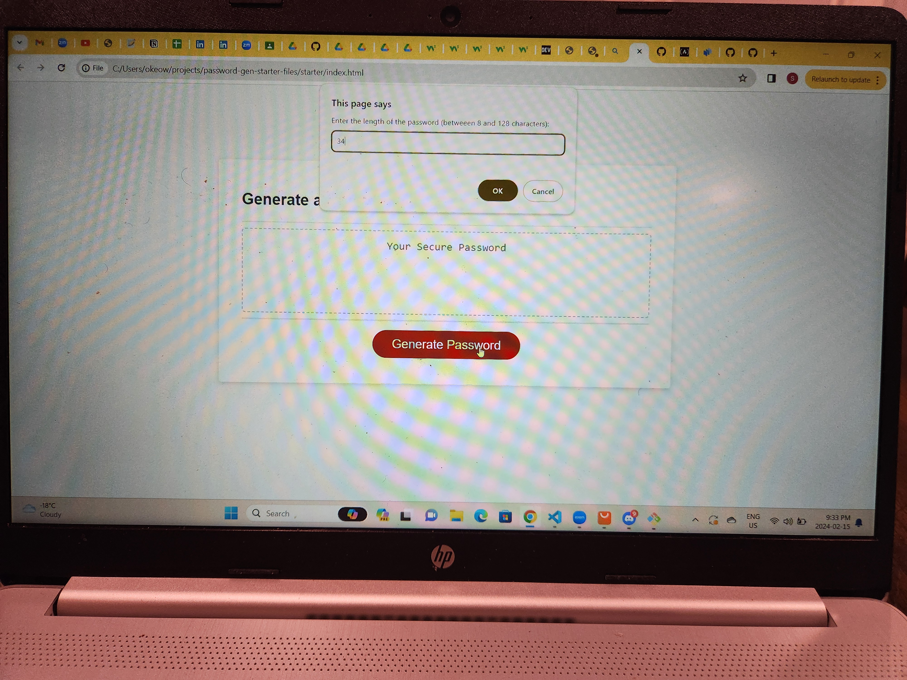
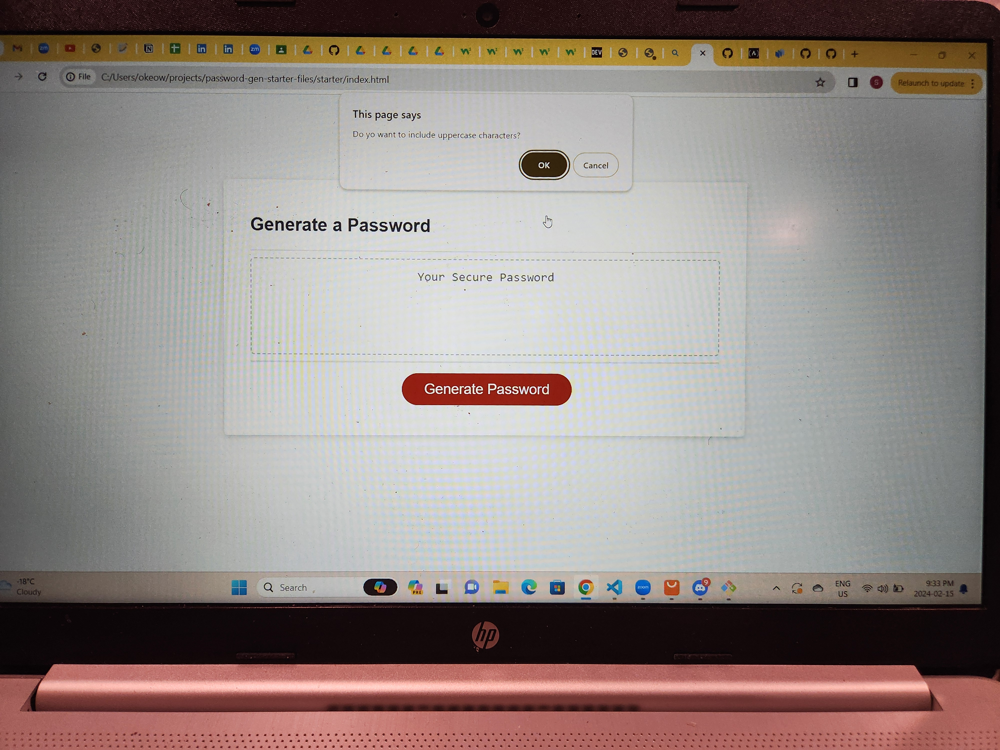
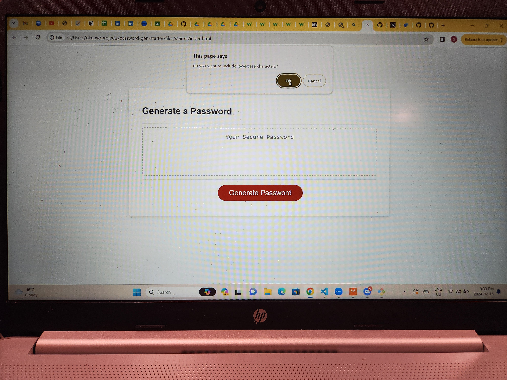
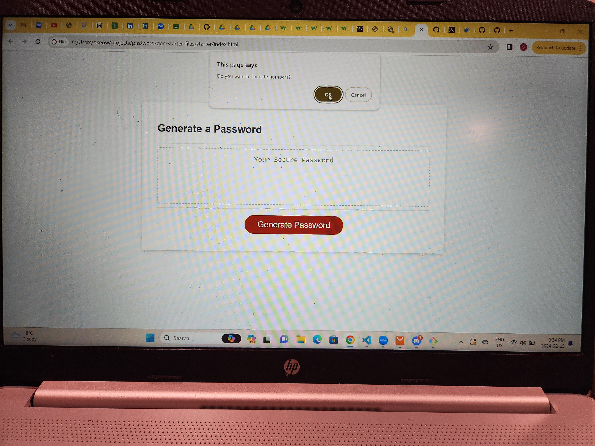
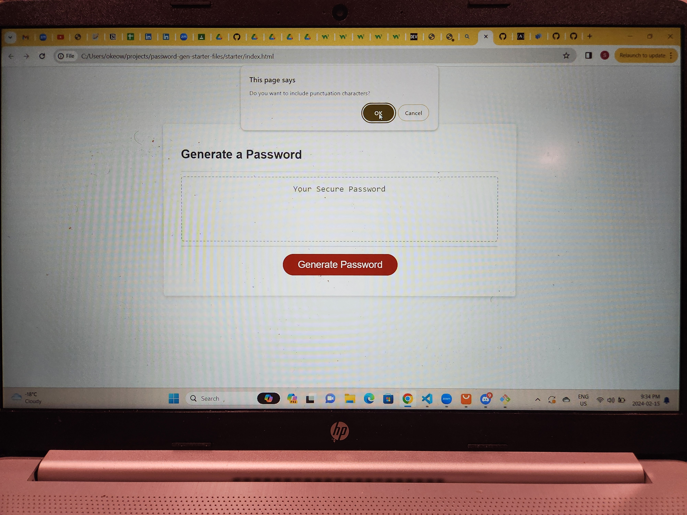
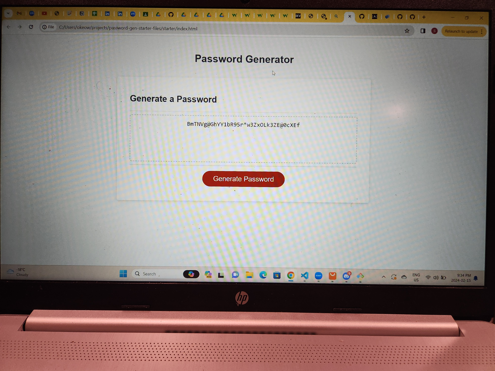

# Password-generator
## PASSWORD GENERATOR

## Project Title:

* This project is a software called password generator.

## Project Description:

* The passowrd generator is a software tool that creates random or customized passowrd for users. it helps users create strong passwords that provides greater security for a given type of access. I employed the use of languages such as html, css and javascript to build this software tool. Coming up with code to make this work wasnt an easy task, as i had difficulties putting together the right code for the execution of uppercase and lowercase letter,puntuation characters,number, and other special characters to be generated as password which i was able to to figure out after.

## Installation:

* To install this code, download the zip file, or use GitHub's guidelines to clone the repository.
## Usage:
 
* To execute file, open in browser.

* The user will be prompted to choose from the following password criteria. 

* The length of the password between 8 and 128 characters.

* The user will receive a confirmation to include uppercase characters.

* The user will receive a confirmation to include lowercase characters.

* The user will receive a confirmation to include numbers

* The user will receive a confirmation to include punctuation characters.

* The application will validate user input and ensure that at least one character type is selected. Once all prompts are answered, the user will be presented with a password matching the answered prompts and displaying the generated password in the text area.

## Credit:

* Had tips and insights from https://www.w3schools.com/js/js_htmldom_eventlistener.asp

## License:

* Copyright(c) Microsoft Corporation. All rights reserved.

* Licensed under the MIT license.

